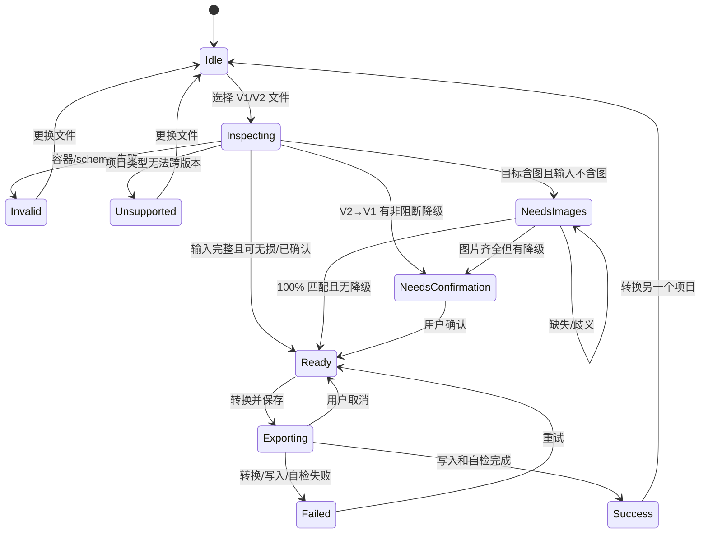
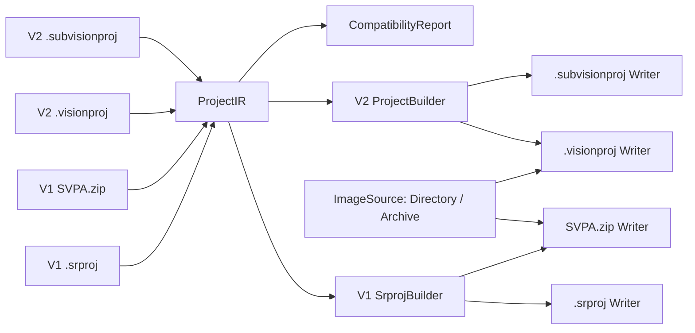

# SaigeVision 项目双向转换器 Webapp — MVP 规格

> 文档版本：0.3
> 日期：2026-08-14
> 产品版本：v0.0.2
> 状态：Classification 与多边形 Segmentation 已实现；Detection 及其他类型等待后续版本

## 1. 产品结论

在一个纯浏览器 Webapp 中完成 SaigeVision V1 与 V2 项目的双向转换：

```text
V1 .srproj / SVPA.zip
        ⇅
V2 .visionproj / .subvisionproj
```

支持的转换方向：

1. V1 `.srproj` → V2 `.visionproj` / `.subvisionproj`。
2. V1 SVPA `.zip` → V2 `.visionproj` / `.subvisionproj`。
3. V2 `.visionproj` → V1 SVPA `.zip`；不输出引用包内虚拟路径的独立 `.srproj`。
4. V2 `.subvisionproj` → V1 `.srproj`；补齐图片后可输出 SVPA `.zip`。
5. 裸 `.srproj` → SVPA `.zip`，保留现有 V1 打包能力。

页面只有一个文件入口。系统自动识别输入版本与容器，只展示该输入可生成的目标格式。项目和图片始终在本机浏览器中处理，不上传服务器。

## 2. 核心设计决策

- 做一个 App，不拆成 V1→V2、V2→V1 和 V1 打包三个工具。
- 用户先选择文件，系统识别版本后动态显示目标格式；无需先选转换方向。
- 所有格式先解析为统一 `ProjectIR`，再由目标 Writer 输出，避免成对实现四套转换逻辑。
- SVPA ZIP 是 V1 的自包含交换包；`.visionproj` 是 V2 的自包含项目包。二者都是 ZIP，但内部协议不同，不能改扩展名代替转换。
- `.srproj` 和 `.subvisionproj` 都不携带图片。生成含图输出时必须读取用户授权的图片目录。
- `.visionproj` 和完整 SVPA ZIP 已携带图片，转换时直接使用包内图片。
- `.srproj` 需要图片路径。V2→V1 时采用“目标路径策略”，不得把 `.visionproj` 内部的 `images/...` ZIP 路径误写成可长期使用的本机绝对路径。
- V2 可能包含 V1 无法表达的数据。反向转换必须先生成兼容性报告；关键字段无法表示时阻止，非关键字段丢失时要求用户明确确认。
- 任意图片、类别、Split 或标注无法可靠映射时禁止静默丢弃。
- v0.0.2 的 Classification / Segmentation 图片白名单为 PNG、JPEG、BMP、GIF、WebP；完整输出逐张核对图片头、真实宽高和项目声明。
- V1 XML 项目文本最大 32 MiB，V2 JSON 项目文本最大 16 MiB；解析器同时限制深度、节点/字段、类别、图片、标签和诊断数量。ZIP 按条目数、单项/总展开大小、压缩比、名称长度及实际读取字节进行双层限制。
- 所有大图片保持流式复制；保存、解压、目录扫描和图片验证支持协同取消。ZIP64 同时按总字节和条目数启用。

## 3. 输入—输出能力矩阵

| 输入 | `.visionproj` | `.subvisionproj` | `.srproj` | SVPA `.zip` |
|---|---:|---:|---:|---:|
| V1 `.srproj` | 需补图片 | 直接 | — | 需补图片 |
| V1 SVPA `.zip` | 直接 | 直接 | — | — |
| V2 `.visionproj` | — | — | — | 直接 |
| V2 `.subvisionproj` | — | — | 可转换 | 需补图片 |

说明：

- “直接”仍包含格式解析、结构校验和兼容性检查。
- `.subvisionproj → .srproj` 可以保留其 `projectFiles[].filePath`。如果这些路径只是相对路径或已经失效，输出 `.srproj` 可以生成，但页面必须警告项目在 V1 中可能找不到图片。
- `.visionproj → .srproj` 当前不开放。通常 `.visionproj` 只保存 `images/...` 包内路径，浏览器保存句柄也不能提供可写入 XML 的持久绝对目录；因此只提供自包含 SVPA ZIP，绝不生成引用 ZIP 内虚拟路径的不可用 `.srproj`。
- 页面只展示跨版本且经过验证的目标；不提供同版本换容器或“提取原文件”的次要入口。

## 4. 关键用户故事

### 4.1 V1 迁移到 V2

作为 V1 用户，我选择 `.srproj` 或现有 SVPA ZIP，能够得到 V2 `.visionproj` 或 `.subvisionproj`。

### 4.2 V2 回退到 V1

作为仍需使用 V1 的用户，我选择 `.visionproj` 或 `.subvisionproj`，能够得到可用的 V1 输出，并看到无法在 V1 中保留的字段清单；如果独立 `.srproj` 缺少可用图片路径，则改为提供 SVPA ZIP。

### 4.3 V2 导出成可交付 V1 包

作为项目交付人员，我选择 `.visionproj`，能够直接得到包含新建 `.srproj`、全部图片、manifest 和修复助手的 SVPA ZIP。

### 4.4 V2 轻量项目补图后打包

作为只有 `.subvisionproj` 的用户，我选择图片目录并完成唯一匹配后，能够得到完整 SVPA ZIP。

## 5. 输入契约

### 5.1 V1 `.srproj`

- 必须是可解析的 V1 XML。
- 识别项目版本、项目类型、类别、图片、尺寸、Split 和标注。
- 图片路径为空、类别引用非法、必要几何字段无效时阻止转换。
- 生成含图输出时使用文件名索引和最长尾路径匹配；所有引用必须唯一匹配。

### 5.2 V1 SVPA `.zip`

兼容现有 `SaigeVision-v1-project-export` 的 `legacy-v0`：

```text
<项目名>_SVPA_<时间>.zip
├─ 项目/<项目名>.srproj
├─ 图像/...
├─ svpa_manifest.json
├─ 使用说明.txt
└─ 一键修复并打开项目.exe
```

manifest 最小结构：

```json
{
  "ProjectFile": "项目/example.srproj",
  "OriginalProjectDirectory": "",
  "Entries": [{
    "OriginalPath": "D:\\images\\001.png",
    "RelativePath": "图像/images/001.png"
  }]
}
```

验证要求：

- ZIP 根目录恰有一个 `svpa_manifest.json`。
- `ProjectFile` 指向一个实际 `.srproj`。
- 每个 `RelativePath` 指向实际图片，映射一对一且大小写折叠后无冲突。
- 拒绝绝对 ZIP entry、`..`、加密包、损坏 CRC、符号链接型条目和异常压缩比。
- 不执行包内 EXE；V2 转换时忽略说明和修复助手。
- 后续 manifest 可加版本、大小、哈希、MIME 和尺寸；读取器继续兼容无版本 legacy 格式。

### 5.3 V2 `.visionproj`

- 必须是合法 ZIP/ZIP64，而非仅有该扩展名。
- 根部恰有一个项目 JSON，顶层为 `{ "project": ... }`。
- `project.projectFiles[].filePath` 必须安全指向包内 `images/...` 文件。
- 所有图片条目可读取，实际宽高与项目数据一致。
- 拒绝绝对 entry、路径穿越、加密包、损坏 CRC、重复/大小写冲突和 ZIP bomb。
- 输入图片保持原始字节，作为 V1 SVPA 输出的图片源。

### 5.4 V2 `.subvisionproj`

- 必须是 UTF-8 JSON，不是 ZIP。
- 顶层为 `{ "project": ... }`，并通过已知 V2 schema 验证。
- 不包含图片；`projectFiles[].filePath` 可能是绝对路径、相对路径或失效路径。
- 生成 SVPA ZIP 时必须补选图片目录并达到 100% 唯一匹配。
- 仅生成 `.srproj` 时允许没有图片，但所有路径问题都进入兼容性报告。

## 6. 输出契约

### 6.1 V1 `.srproj`

- UTF-8 XML，根节点 `<Project>`。
- `Version` 使用目标 V1 已验证的 schema 版本；MVP 固定为 golden fixtures 证明兼容的版本，不允许按输入猜测。
- 写出 V1 可表达的项目类型、类别、颜色、图片、宽高、Split 和标注。
- V2 数值/字符串 ID 不直接泄漏进 V1 索引字段；类别和图片引用按稳定顺序重建。
- V2 `train` / `val` 映射到 V1 `Training` / `Validation`；多个 V2 splitSets 的降维规则必须通过项目类型 fixture 明确。
- 若选择 `.srproj` 单文件输出：
  - `.subvisionproj` 输入优先保留其源路径；
  - `.visionproj` 输入仅在存在可用外部路径，或用户明确选择“导出图片到目标目录”时显示该输出；否则隐藏 `.srproj`，只提供 SVPA ZIP；
  - 用户可选图片目标目录时，Writer 按该目录规划路径并保持 XML 与导出图片结构一致。
- 输出前生成兼容性报告，列出“保留、重建、降级、丢弃、阻断”字段。

### 6.2 V1 SVPA `.zip`

- 命名 `{name}_SVPA_{timestamp}.zip`。
- 结构与现有 V1 导出器兼容：新建 `.srproj`、全部引用图片、`svpa_manifest.json`、本地化说明、修复助手。
- `.visionproj` 输入时直接把包内图片流式写入；`.subvisionproj` 输入时使用用户授权目录中的唯一匹配图片。
- manifest 的 `OriginalPath` 必须与新建 `.srproj` 中的 `<Path>` 完全对应。
- `RelativePath` 指向实际包内图片；同名冲突使用确定性后缀并同步 manifest。
- 图片逐字节保留，ZIP STORE，不转码；大项目启用 ZIP64 和流式写盘。
- 解压后 ZipFixer 能把新建 `.srproj` 路径修复为实际包内位置并由 V1 打开。

### 6.3 V2 `.visionproj`

```text
<项目名>.visionproj
├─ <项目名>.json
└─ images/...
```

- 根部恰有一个 `{ "project": ... }` JSON。
- `projectFiles[].filePath` 一对一指向 `images/...`。
- 图片内容不缩放、不转码；同名冲突确定性解决并同步 JSON。
- 不写入 V1 `.srproj`、manifest、说明或修复 EXE。

### 6.4 V2 `.subvisionproj`

- UTF-8 裸 JSON，不是 ZIP。
- schema 与 `.visionproj` 内项目 JSON 相同。
- 不含图片；保留源图片路径语义。
- 页面提示导入时原图片必须仍在原路径。

## 7. V2→V1 兼容性规则

V2 数据模型比 V1 更丰富，反向转换不承诺无损。每次转换分类处理字段：

| 处理等级 | 行为 |
|---|---|
| 保留 | V1 有明确等价字段，直接映射并验证 |
| 重建 | V1 需要索引/顺序而 V2 使用 ID，按确定性规则重建 |
| 降级 | 多个 V2 结构需合并为一个 V1 字段，显示规则并要求确认 |
| 丢弃 | 对项目核心语义无影响但 V1 无字段；列入报告并要求确认 |
| 阻断 | 会改变图片、类别、Split 或标注语义；不得输出 |

潜在不对称字段包括：

- 多 dataset、多 split set、`not-split` 或自定义 split 名称。
- metadata、description、createdBy、assigned/registered 时间和内部 ID。
- ROI 中尚未验证的 Advanced、Ellipse、Blind、多区域及非默认参数。
- OCR 文本、旋转框角度/中心数据、复杂 contour、多环/洞、自定义标签类型。
- V2 独有项目类型及 V1 无对应的 class/project 属性。

MVP 策略：

- 仅对 golden fixtures 已证明双向等价的项目类型启用 V2→V1。
- 项目含多个 dataset 或同一图片属于相互冲突的 split 时先阻断，直到有明确规则。
- metadata、内部 ID、审计时间等非训练语义字段可丢弃，但必须出现在报告中。
- ROI 仅开放 `none` 与经过真实样本验证的 Simple Rectangle。内部统一使用归一化 LTRB；V1 `Width/Height` 是尺寸，V2 `roiWidth/roiHeight` 实际是右/下边界。任何未知活动 ROI 都是阻断项，确认丢失不能绕过。
- ROD、OCR、Anomaly、Image Generation 等没有 V1 等价 fixture 的类型默认阻断。
- 不提供“尽力导出”隐藏开关。

## 8. 单页交互

### 8.1 首屏

- 标题：`SaigeVision 项目转换`。
- 副标题：`在 V1 与 V2 项目格式之间转换。`
- 隐私：`本地处理 · 不上传项目或图片`。
- 一个拖放区：`选择 .srproj、SVPA.zip、.visionproj 或 .subvisionproj`。
- 文案使用“选择/读取”，不使用“上传”。

### 8.2 自动识别后

显示：

- 文件名、输入版本和格式，例如 `V2 完整项目 · .visionproj`。
- 项目类型、类别、图片、标注和 Split 摘要。
- `更换` 次要操作。
- 只展示合法目标：
  - V1 输入：`.visionproj` / `.subvisionproj`；完整匹配后另有 `仅导出 V1 项目 ZIP`。
  - V2 `.visionproj`：提供自包含 `SVPA.zip`；不提供路径不可用的独立 `.srproj`。
  - V2 `.subvisionproj`：提供 `.srproj`；补齐图片后也提供 `SVPA.zip`。
- 默认选择跨版本、可迁移性更完整的含图输出：V1→V2 默认 `.visionproj`；V2→V1 默认 SVPA ZIP。

### 8.3 按需补图

- `.srproj → .visionproj/SVPA.zip`：要求图片目录。
- `.subvisionproj → SVPA.zip`：要求图片目录。
- `.visionproj → SVPA.zip`、SVPA ZIP → `.visionproj`：直接验证包内图片。
- 不含图输入选择不含图目标时，不强制补图，但显示路径依赖/需修复提示。
- 目录可多次添加；显示已匹配/总数、缺失和歧义。达到 100% 唯一匹配才启用含图输出。

### 8.4 兼容性确认

- V2→V1 在输出区下显示一行：`V1 兼容性：可转换 · 3 个字段将重建`。
- 有非阻断丢失时展开简短列表，并要求勾选 `我已了解上述字段不会写入 V1`。
- 有阻断项时主按钮不可用，明确指出项目类型/标签/数据集结构无法转换。
- 不把长字段报告常驻首屏；默认显示计数和前 3 项，可下载完整 JSON 报告。

### 8.5 主操作

- 单页最多一个主按钮，动态文案：
  - `转换并保存 .visionproj`
  - `转换并保存 .subvisionproj`
  - `转换并保存 .srproj`
  - `创建并保存 SVPA.zip`
- 保存选择器在用户点击且手势仍有效时优先打开，然后再执行长时间转换。
- 处理中显示阶段及按字节进度；用户取消保存回到可转换状态，不算错误。
- 成功态显示文件名、大小、图片数量和关键提醒。

## 9. 状态机



## 10. 双向转换架构



建议模块：

- `SrprojInputAdapter` / `SvpaZipInputAdapter`。
- `VisionprojInputAdapter` / `SubvisionprojInputAdapter`。
- `ProjectIR` 与 `ImageSource`。
- `V1ProjectBuilder` / `V2ProjectBuilder`。
- 四个 Writer。
- `CompatibilityAnalyzer` / `ConversionReport`。
- `ArchiveValidator` / `ImageResolver`。

## 11. 项目类型发布策略

首版不得根据字段名猜测格式。每个方向、每种类型均需独立发布门禁。

| 项目类型 | V1→V2 | V2→V1 | 发布门槛 |
|---|---|---|---|
| Classification | P0 | P0 | V1→V2→V1 round-trip；类别/每图标签/Split 一致 |
| Detection | P1 | P1 | 矩形框、类别、空标注及边界坐标 round-trip |
| Segmentation | 已开放 | 已开放 | V1 Outer/Inner、V2 winding、多轮廓/孔洞、正常/未标注状态与 Split round-trip |
| ROD | 待 fixture | 默认阻断 | V1 是否有等价旋转框 schema 未确认 |
| OCR / Anomaly / 其他 | 默认阻断 | 默认阻断 | 获得双向 golden fixtures 后单独启用 |

## 12. 验收标准

### 通用

- 全流程无登录、后端转换、数据库或对象存储。
- 没有项目内容、图片或完整客户路径外发。
- 文件扩展名、magic、容器和 schema 四层验证一致。
- 输出路径安全，中文/韩文/空格和同名图片可处理。
- 同一输入产生语义确定的结构；重建 ID/时间等差异明确列出。
- 输出自检失败不得显示成功。

### V1 输出

- `.srproj` 为目标 V1 可读取的 XML，类别、图片、Split 和标注统计与可表达源语义一致。
- SVPA ZIP 由现有 ZipFixer 成功修复；修复后 V1 能打开且图片/标签正确。
- V2→V1→V2 round-trip 的 canonical ProjectIR 仅允许报告中声明的降级字段不同。
- V2 无法在 V1 表达的关键语义必须阻断，不得静默丢弃。

### V2 输出

- `.visionproj` / `.subvisionproj` 能被目标 V2 导入。
- 类别、图片、Split、标注及几何在已定义容差内一致。
- `.visionproj` 图片字节与输入一致；`.subvisionproj` 不含图片。

## 13. 测试矩阵

| 输入 | 输出 | 图片来源 | 必测结果 |
|---|---|---|---|
| `.srproj` | `.visionproj` | 选择目录 | V2 导入，语义一致 |
| `.srproj` | `.subvisionproj` | 无 | 路径语义，V2 导入 |
| `.srproj` | SVPA ZIP | 选择目录 | ZipFixer/V1 兼容 |
| SVPA ZIP | `.visionproj` | 包内 | 流式转换，V2 导入 |
| SVPA ZIP | `.subvisionproj` | 无 | manifest 原路径，V2 导入 |
| `.visionproj` | SVPA ZIP | 包内图片 | 解压、修复后由 V1 打开；不生成路径不可用的裸 `.srproj` |
| `.visionproj` | SVPA ZIP | 包内 | ZipFixer 后 V1 打开 |
| `.subvisionproj` | `.srproj` | 无 | 保留源路径，V1 打开或明确缺图告警 |
| `.subvisionproj` | SVPA ZIP | 选择目录 | 100% 匹配，V1 打开 |
| 任一不含图输入 | 含图输出且缺图/歧义 | 不完整目录 | 阻止导出 |
| V2 含多 dataset/未知标签 | V1 任一输出 | 任意 | 按兼容性规则阻断/确认 |
| 恶意或损坏 ZIP | 任意 | — | 安全拒绝，不产生半成品 |

每个公开支持的项目类型都必须有：V1 `.srproj`、SVPA ZIP、V2 `.visionproj`、`.subvisionproj`、预期 IR、双向 canonical diff 和两代软件实机导入记录。

## 14. 错误与边界

- 扩展名与 magic 不一致；XML/JSON/ZIP 损坏或 schema 未知。
- 浏览器安全处理边界为 V1 XML 32 MiB、V2 JSON 16 MiB；V1 XML 最多 524,288 个节点和 1,048,576 个属性。
- 多边形项目按全部标注轮廓累计计数，V1 与 V2 均最多处理 500,000 个轮廓点；单个轮廓同样不得越过该项目级上限。
- 超过文本、结构或轮廓点上限表示项目规模超出当前浏览器安全处理范围，不等同于源项目损坏；界面必须显示对应的规模提示，不得回退为“文件已损坏”。
- 空路径、重复引用、缺图、同名歧义和图片尺寸不一致。
- manifest/JSON 路径穿越、大小写冲突、ZIP 加密、CRC 损坏或 ZIP bomb。
- V2 多 dataset、多重/冲突 split、自定义 metadata 或 V1 无法表达的标签类型。
- ROD/OCR、bitmap-only mask、退化或方向不明确的 contour 等目标版本无已验证等价表示。
- 写入权限撤销、磁盘空间不足、浏览器内存不足或用户取消。
- 超大文件在不支持流式保存的浏览器中阻止 Blob 回退并建议 Edge/Chrome。

## 15. 非目标

- 不迁移训练模型、训练历史、报告、运行环境或许可证。
- 不编辑、修复或猜测标注语义。
- 不在线存储、分享或托管项目。
- MVP 不批量转换多个项目。
- 不承诺未经双向 fixture 验证的版本、项目类型和标签类型。
- 不伪装成完全无损；所有降级均显式报告。

## 16. 实施顺序

### 阶段 A：双向 golden 基线

- 对 Classification 建立 V1 `.srproj` / SVPA ZIP / V2 `.visionproj` / `.subvisionproj` 四件套。
- 建立 V1→V2、V2→V1 和 round-trip canonical ProjectIR 比较器。
- 记录两代 SaigeVision 实机导入结果和允许变化字段。

### 阶段 B：统一输入与图片源

- 实现四种 InputAdapter、容器安全验证和统一 `ProjectIR + ImageSource`。
- 复用目录授权、最长尾路径匹配、ZIP64 流式写盘和保存时序。

### 阶段 C：Classification 双向核心

- 实现 `V1ProjectBuilder`、`V2ProjectBuilder` 和四个 Writer。
- 完成兼容性分析、目标路径策略与 SVPA ZipFixer 回归。

### 阶段 D：页面与硬化

- 落地自动识别、动态目标、补图、兼容性确认、进度和成功态。
- 完成大文件、恶意 ZIP、写入中断及桌面/移动端测试。

### 阶段 E：逐类扩展

- Segmentation 多边形已通过 V1 真实样本、V2 原生容器 golden 与双向生成 round-trip 后启用。
- Detection 取得独立双向 fixtures 后启用。
- ROD、OCR 和其他类型独立评估，不复用“看起来相似”的标注映射。

## 17. 开发开始条件

可以开始输入解析器、容器校验和页面骨架；开始任何 V1↔V2 字段映射前，必须先完成 Classification 双向 golden 基线。当前确认了容器形态，但不能仅凭字段名称宣称 V2→V1 无损兼容。
